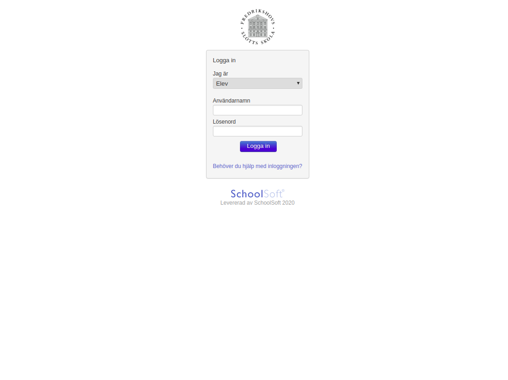
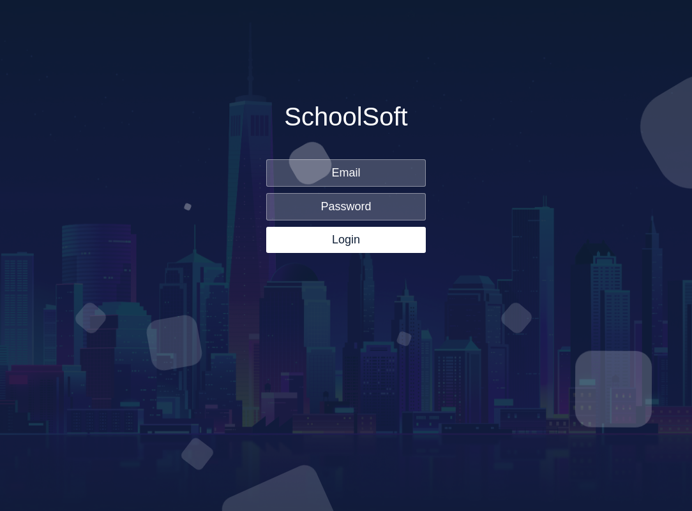

# Schoolsoft Fixer
Due to SchoolSoft's **horrific** User Interface and design, combined with the inept software company's inability to code simple CSS, I've decided to take matters into my own hands. This project is a **Google Chrome Extension** and will *fix* the following pages

# Examples
Below you will find examples of pages before and after the installation of the extension.

## Login Page



## How to use
1) ```$ git clone <repo>``` or update existing download ```$ git pull```.
2) Navigate to ```chrome://extensions``` in your Chrome browser.
3) Click **Load unpacked** and select the schoolsoft-fixer folder.
4) Restart your browser.

## License
This project is licensed under the MIT License.
See the `LICENSE` file for more information.
